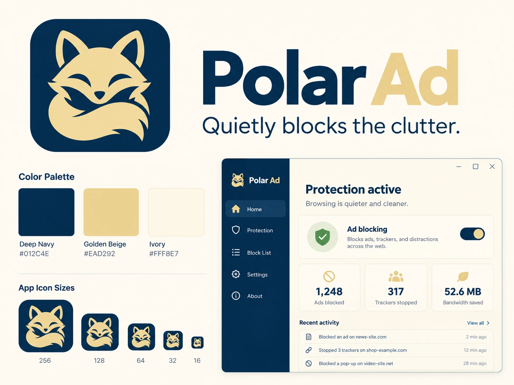

# Polar Ad

**조용히 광고를 걸러냅니다.**

Polar Ad는 Windows PC의 **모든 브라우저**(Chrome, Edge, Firefox 등)에서 광고와 추적 요청을 차단하는 프로그램입니다. 브라우저마다 확장 프로그램을 따로 설치할 필요가 없고, 한 번 설치하면 컴퓨터를 켤 때 자동으로 보호가 켜집니다.



> 설치 프로그램 이름은 **Polar Project**입니다. 프로그램 안에서는 **Polar Ad**로 표시됩니다.

---

## 주요 기능

- **브라우저 공통 차단**: PC의 DNS 단계에서 광고·추적 도메인을 막아, 어떤 브라우저를 쓰든 같은 보호를 받습니다.
- **기본 규칙 내장**: 국내 주요 광고 서버를 처음부터 차단합니다. 설치만 하면 바로 적용돼요.
- **자동 차단 목록 업데이트**: 공개 차단 목록을 설정한 주기(기본 24시간)마다 자동으로 새로 받아옵니다.
- **자동 실행**: 로그인하면 관리자 권한으로 조용히 시작합니다. UAC 창이 뜨지 않아요.
- **내 규칙 / 허용 목록**: 직접 차단할 도메인을 추가하고, 사이트가 깨지면 허용 목록에 넣어 즉시 해제할 수 있습니다.
- **활동 기록**: 어떤 앱이 어떤 도메인을 요청했고 무엇이 차단됐는지 시간순으로 확인합니다.
- **안전한 복구**: 끄기, 종료, 제거 시 원래 DNS 설정으로 돌아갑니다. 비정상 종료 후에도 "네트워크 설정 복구" 버튼으로 되돌릴 수 있어요.
- **로컬 전용**: 방문 기록과 요청 내용은 PC 밖으로 전송되지 않습니다.

---

## 화면 미리보기

<!-- 실제 실행 화면 스크린샷을 아래 경로에 넣어 주세요. -->
| 홈 (보호 중) | 차단 목록 |
|---|---|
| `docs/images/screenshot-home.png` | `docs/images/screenshot-blocklist.png` |

| 활동 기록 | 보호 설정 |
|---|---|
| `docs/images/screenshot-log.png` | `docs/images/screenshot-protection.png` |

---

## 설치 방법

1. [Releases](https://github.com/logan-repo/polar-ad/releases)에서 **PolarProjectSetup-1.0.0.exe**를 받습니다.
2. 실행하고 **관리자 권한**(UAC)을 허용합니다. DNS 설정을 바꾸기 위해 필요합니다.
3. 설치 중 **"Windows 시작 시 자동 실행"** 을 체크한 상태로 두면 로그인할 때 자동으로 켜집니다.
4. 시작 메뉴에서 **Polar Ad**를 실행하고, **보호 기능 켜기**를 누르세요.

**시스템 요구 사항**: Windows 10 / 11 (64비트), 관리자 권한

---

## 차단 범위와 한계

Polar Ad는 **도메인 단위**로 차단합니다. 그래서 다음을 분명히 해 두어야 합니다.

- **차단되는 것**: 광고 네트워크, 추적·분석 서버처럼 광고 전용 도메인에서 오는 요청.
- **차단되지 않을 수 있는 것**:
  - 콘텐츠와 같은 도메인에서 함께 나오는 광고 (예: 일부 사이트의 자체 배너)
  - 유튜브 영상 중간 광고 (서버에서 영상에 직접 끼워 넣는 방식이라 네트워크 단계에서는 구분할 수 없습니다)
- **"모든 광고를 100% 차단"하지는 않습니다.**

사이트가 깨지면 **활동 기록**에서 해당 도메인을 골라 **"선택한 사이트 허용"**을 누르세요. 즉시 해제됩니다.

---

## 개인정보

- 차단 목록, 규칙, 활동 기록은 모두 이 PC의 `%LocalAppData%\PolarAd` 안에만 저장됩니다.
- 방문 기록이나 웹 페이지 내용을 외부 서버로 보내지 않습니다.
- 차단 목록은 설정에 등록된 공개 목록 주소에서만 내려받습니다.

---

## 제거 방법

1. 트레이 아이콘에서 **종료**를 누르면 DNS가 원래대로 돌아갑니다.
2. Windows 설정 → 앱 → 설치된 앱에서 **Polar Project**를 제거합니다. 제거하면 DNS가 한 번 더 확인해서 복구되고, 자동 실행 설정도 함께 지워집니다.

---

## 개발자용 빌드

```bash
dotnet test PolarAd.sln
dotnet publish src/PolarAd.App/PolarAd.App.csproj -c Release -r win-x64 --self-contained true -p:PublishSingleFile=true -o publish
cd installer
iscc PolarAd.iss
```

프로젝트 구조: `src/PolarAd.Core`(DNS 서버, 규칙 엔진, 차단 목록, 자동 실행), `src/PolarAd.App`(WPF 화면, 트레이), `tests/PolarAd.Tests`(단위·통합 테스트 24개), `installer/`(Inno Setup 스크립트).

---

## 라이선스

이 저장소의 라이선스는 아직 정하지 않았습니다.
